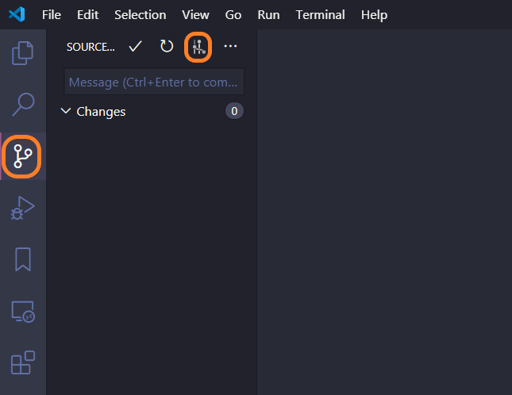
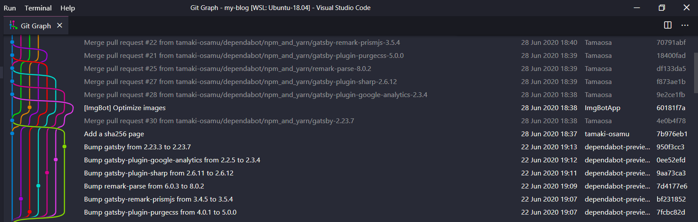
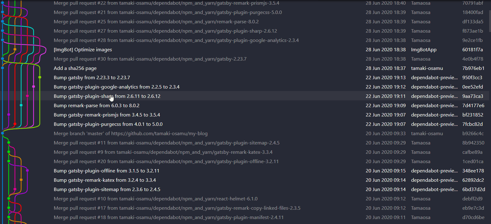
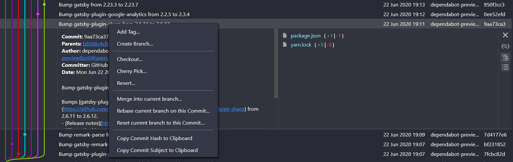

Visual Studio Code で Git の履歴をいい感じに表示してくれる**Git Graph** がいい感じだったのでメモします。

## インストール

Marketplace からインストールできます。

[Git Graph](https://marketplace.visualstudio.com/items?itemName=mhutchie.git-graph)

## 使い方

Git のメニューに下のようなアイコンが表示されるので、選択すると Git の履歴が表示されます。

## 良いところ

### 普通に見やすい

実際 Git の履歴をこんな感じに表示してくれます。

ブランチも普通に見やすくていい感じです。

### 履歴を表示してくれるだけじゃない

Git 履歴を表示してくれるだけではなく他にもいろいろなことができます。

#### 差分を見る

コミットをクリックすると変更したファイルが見れます。さらにさらに差分もみることができます。ポチポチするだけで便利です。

#### Git の操作をする

コミットに対して右クリックすると以下のようなメニューが表示され Git の操作が行えます。

- Tag
- Branch
- Checkout
- Cherry Pick
- Revert
- Merge
- Rebase
- Reset

とくに Cherry Pick や Revert なんかは**コミット ID をわざわざ入力せず**クリックだけでできてしまうのですごい便利なんですよね。

また、コミット ID(Commit Hash)も簡単にコピーできるので、コマンドライン派の人にも便利だと思います。

## さいごに

[GitLens](https://marketplace.visualstudio.com/items?itemName=eamodio.gitlens)を使ってる人は結構いるみたいだけど（個人の感想）、この Git Graph もすごい便利なのでぜひ使ってみてください。
