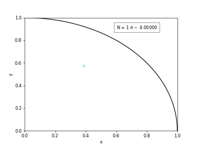
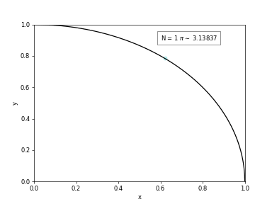
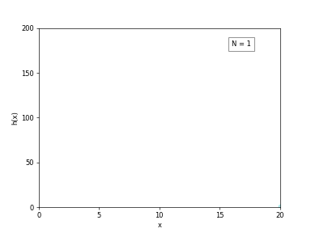
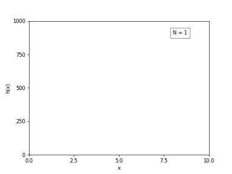
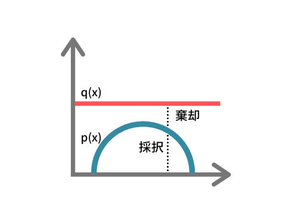
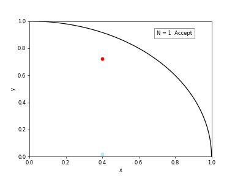
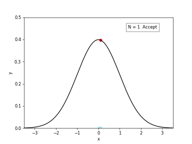

昔モンテカルロ法を勉強していた頃のノートを発掘したのでメモします。ここでは厳密な議論は避けてモンテカルロ法のざっくりとしたイメージの紹介に専念します。

## モンテカルロ法とは

[Wikipedia](https://ja.wikipedia.org/wiki/%E3%83%A2%E3%83%B3%E3%83%86%E3%82%AB%E3%83%AB%E3%83%AD%E6%B3%95) を見ると、

> シミュレーションや数値計算を乱数を用いて行う手法の総称

とあります。有名なのはダーツを投げて円周率を求める計算ですよね。とりあえずやってみましょう。

1×1 の領域で一様に分布する乱数をプロットしていき、1/4 円の中に入ったプロットを数え上げていきます。この時**プロット数が十分に大きければ**、

$$
\small
\frac{(\text{円の面積})}{(\text{正方形の面積})} \sim \frac{(\text{円内のプロット数})}{(\text{全プロット数})}
$$

になることを利用して円周率（要は 1/4 円の面積）の計算をしています。

## 面積を計算する

上記では乱数を用いて面積比を求めていましたが、今度は 1/4 円の面積をより直接的に計算してみます。

区間[0,1]で一様に分布する乱数$X_1,X_2,...,X_N$を考えてみます。この時**サンプル数$N$が十分に大きければ**1/4 円の面積$S$は、$\sqrt{1-X^2}$の値を足し合わせた値で書けそうです。すなわち、

$$
\begin{aligned}
S &= \int^1_0 \sqrt{1-x^2} dx \\
&\sim \frac{1}{N} {\small \left\{\sqrt{1-X_1^2}+...+\sqrt{1-X_N^2})  \right\}}
\end{aligned}
$$

で書けそうな感じがします。実際に計算してみると、

上記では$\pi (=4S)$を表示していますが、うまく計算できていそうなことがわかると思います。

一般的に関数$f(x)$の区間[a,b]での積分は、区間 [a, b]の一様分布 $p_r(x)$を導入すると、

$$
\begin{aligned}
\int^b_a f(x) dx &= \int^b_a \frac{f(x)}{p_r(x)} p_r(x)dx \\
&\sim \frac{1}{N} \sum^N_{i=1} \frac{f(X_i)}{p_r(X_i)} \\
&= \frac{(b-a)}{N} \sum^N_{i=1} f(X_i)
\end{aligned}
$$

で書くことができます。ここで、$X_1,X_2,...,X_N$は一様分布$p_r(x)$から**サンプリング**してきた値で、また区間 [a, b]の一様分布$p_r(x)=1/(b-a)$であることを利用しています。

このような乱数を用いた数値積分は**モンテカルロ積分**と呼ばれ数値計算の分野ではよく利用されます。

### ところで

上記の円周率の計算はたいして精度よくないです。これはサンプル数$N$が十分ではないためです。モンテカルロ積分の誤差はサンプル数$N$に対して$O(1/\sqrt{N})$で書けます。実際のところ、上記のような低次元の積分ではモンテカルロ積分よりも[台形公式](https://ja.wikipedia.org/wiki/%E5%8F%B0%E5%BD%A2%E5%85%AC%E5%BC%8F)に代表される決定論的な手法の方が効率は良いです。

一方で、高次元（Davis と Rabinowitz によれば 15 次元以上）の積分を行う場合、モンテカルロ積分は強力な手法になります。これは原理的に**モンテカルロ積分の誤差が非積分関数の次元に依存しない**ためです。台形公式などの求積法ではいわゆる[次元の呪い](https://ja.wikipedia.org/wiki/%E6%AC%A1%E5%85%83%E3%81%AE%E5%91%AA%E3%81%84)の影響を強く受けてしまいます。

## 期待値を計算する、あるいはサンプリング

このモンテカルロ積分はよく期待値$I$の計算に利用されます。すなわち、

$$
I = \int f(x)p(x) dx \sim \frac{1}{N} \sum^N_{i=1} f(X_i)
$$

です。つまりモンテカルロ積分の考えによれば、**任意の確率分布$p(x)$に従う十分な数のサンプル$X_1,X_2,...,X_N$を得ることができればは平均するだけでその期待値が得られる**わけです。

ではどうすれば任意の確率分布からサンプリングが行えるでしょうか。

### 一様乱数

今更ですが一様乱数にも触れておきます。一様乱数でヒストグラムを作ってみると、

となり一様分布からサンプリングできていることが分かります（もちろんサンプル数を増やせばより一様になる）。

一様乱数の発生方法は、[線形合同法](https://ja.wikipedia.org/wiki/%E7%B7%9A%E5%BD%A2%E5%90%88%E5%90%8C%E6%B3%95)から [Mersenne Twister](http://www.math.sci.hiroshima-u.ac.jp/~m-mat/MT/mt.html) や [Xorshift](https://ja.wikipedia.org/wiki/Xorshift) などさまざまありますがここでは詳細には触れません（結構大変なので…）。今回は文明の利器としてありがたく利用させて頂くことにしましょう。

### 逆関数法

逆関数法は、[累積分布関数](https://ja.wikipedia.org/wiki/%E7%B4%AF%E7%A9%8D%E5%88%86%E5%B8%83%E9%96%A2%E6%95%B0#:~:text=%E7%B4%AF%E7%A9%8D%E5%88%86%E5%B8%83%E9%96%A2%E6%95%B0%EF%BC%88%E3%82%8B%E3%81%84%E3%81%9B%E3%81%8D,%E7%A2%BA%E7%8E%87%E3%81%AE%E9%96%A2%E6%95%B0%E3%81%AE%E3%81%93%E3%81%A8%E3%80%82)の逆関数を用いるサンプリング手法です。目的とする確率分布$p(x)$の累積分布$F(x)$を用いるとサンプル$X$は、

$$
X = F^{-1}(U)
$$

でかけることを利用します。ここで$U$は区間[0,1)の一様乱数です。

たとえば、指数分布の累積分布の逆関数は、

$$
F^{-1}(x) = -\frac{\log{(1-x)}}{\lambda}
$$

で書けます。これを利用してヒストグラムを作ってみると、

となり指数分布からサンプリングできていることが分かります。

### 棄却サンプリング

逆関数法ではその名の通り逆関数を利用しましたが、解析的に逆関数が得られないような少々複雑な分布（たとえば、正規化定数が分からない分布とか）からサンプリングしたい場合も多々あります。棄却サンプリングでは、このようなサンプリングを**提案分布**を導入することで実現します。

目的とする確率分布$p(x)= \frac{\tilde{p}(x)}{Z}$を覆うような提案分布$q(x)$を導入します。すなわち、

$$
\tilde{p}(x) < kq(x)
$$

を満たす$q(x)$です。ここで、k は任意の定数です。このとき棄却サンプリングは、

1. 提案分布$q(x)$に従う乱数$X$を生成する。
2. 一様乱数$Y$を$0 \leq Y < q(X)$で発生させる
3. $Y<\tilde{p}(X)$であれば$X$を確率分布$p(x)$のサンプルとして採択し、そうでなければ棄却する。

という手順で進みます。

たとえば、分布$\tilde{p}(x)=\sqrt{(1-x^2)}$を一様分布から棄却サンプリングするとことを考えると、

1. 一様乱数$u_1, u_2$を発生させる。
2. $u_1<\tilde{p}(u_2)$であれば$u_2$を確率分布$p(x)$のサンプルとして採択し、そうでなければ棄却する。

となります。わお！これはあの面積比から円周率を求める計算と同じですね！そうですあの円周率の計算は棄却サンプリングの一種なんです。ここから得られるヒストグラムを作ってみると、

となります。だいたい目的とする分布からサンプリングできていることが分かります。

### マルコフ連鎖モンテカルロ法

棄却サンプリングでは提案分布を導入することで、任意の確率分布からのサンプリングを実現しました。しかし、高次元な分布など非常に複雑な分布に対しては適切な提案分布を選ぶのは困難（というかほぼ不可能）になります。そんなときに使うのが**MCMC（マルコフ連鎖モンテカルロ法）**です。

MCMC は任意の確率分布$p(x)$を**定常分布**に持つ[マルコフ連鎖](https://ja.wikipedia.org/wiki/%E3%83%9E%E3%83%AB%E3%82%B3%E3%83%95%E9%80%A3%E9%8E%96)を生成することで、確率分布$p(x)$からサンプリングする手法です。かいつまんで言ってしまうと、目的とする確率分布に従う状態が生成されるように**遷移確率**を定めて、この遷移確率のもと状態を次々と遷移させていくことでサンプルを得る手法です。

#### 詳細つり合い条件

遷移確率の決め方として一般的に利用されるのが[詳細つり合い条件](https://ja.wikipedia.org/wiki/%E8%A9%B3%E7%B4%B0%E9%87%A3%E3%82%8A%E5%90%88%E3%81%84)です。詳細つり合い条件は、ある確率分布$p(x)$における状態$A$から状態$B$への遷移確率を$P(A\rightarrow B)$とおくと、

$$
p_A P(A\rightarrow B) = p_B P(B\rightarrow A)
$$

でかけます。この条件のイメージは[この記事](https://qiita.com/kaityo256/items/f05f9914eb0ad16afe05#fn2)の説明が分かりやすくて、

> $p_A, p_B$はそれぞれの国にいる人の人口で、$P(A\rightarrow B), P(B\rightarrow A)$は、A 国にいる人のうちどのくらいの割合が B 国に移住するかを表している。上記の条件が満たされていれば、移住(遷移)の後でも人口が変わらないのがわかると思う。この条件を詳細釣り合い条件と呼ぶ。

<!--  -->

ここで重要なことは遷移によって各状態の存在確率$p_A, p_B$が変化していないことです。
この**詳細つり合い条件を満たすように遷移をくり繰り返すことで目的の定常分布が得られる**、ということが知られています（詳細な証明は割愛）。

#### メトロポリス法

詳細つり合い条件から遷移確率を得る方法はいくつかありますが、ここではシンプルな[メトロポリス法](https://ja.wikipedia.org/wiki/%E3%83%A1%E3%83%88%E3%83%AD%E3%83%9D%E3%83%AA%E3%82%B9%E6%B3%95)を紹介します。

メトロポリス法では、詳細つり合い条件を満たすように以下の遷移確率を用います。

$$
 P(A\rightarrow B) = \min{ \left\{ 1, \frac{p_B}{p_A} \right\}}
$$

たとえば、標準正規分布の遷移確率は、

$$
P(x\rightarrow x') = \min{ \left\{ 1, e^{(x^2-x'^2)/2} \right\}}
$$

になります。このとき、

1. 状態$x$を与える。
2. 一様乱数等を用いて新たな状態$x+dx$を生成する。
3. 遷移確率の評価をし採択なら$x+dx$を新たな状態とし、棄却なら$x$を新たな状態とする。

という手順で状態を次々と更新していきます。

標準正規分布のヒストグラムを作ってみると、

となります。大方のところ標準正規分布からサンプリングできていることが分かります。ただし、MCMC では**サンプル間に相関がある**ことには注意が必要です。

## おわりに

使用したプログラムは（雑ですが）[ここ](https://github.com/tamaosa/mc-animation)にあげています。必要であれば参考にしてみてください。(…誤りなどがもしあれば PR 等いただけるととても嬉しいです。

## 参考

- [疑似乱数サンプリング](https://hazm.at/mox/math/random/pseudo-random-number-sampling.html)
- [モンテカルロ法の前線 — サイコロ振って積分する方法 —](https://www.smapip.is.tohoku.ac.jp/~smapip/2003/tutorial/textbook/koji-hukushima.pdf)
- [第 11 章 サンプリング法](http://bin.t.u-tokyo.ac.jp/summercamp2015/document/prml11_chika.pdf)
- [モンテカルロ法における詳細釣り合い条件と遷移確率の決め方について](https://qiita.com/kaityo256/items/f05f9914eb0ad16afe05)
