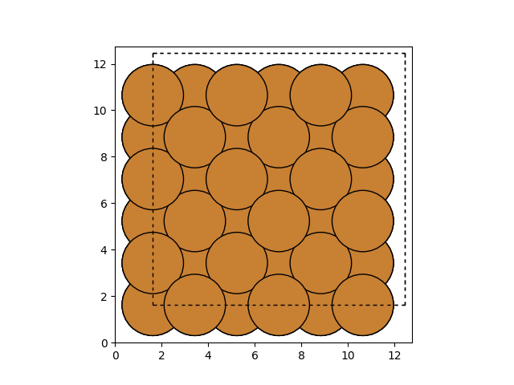
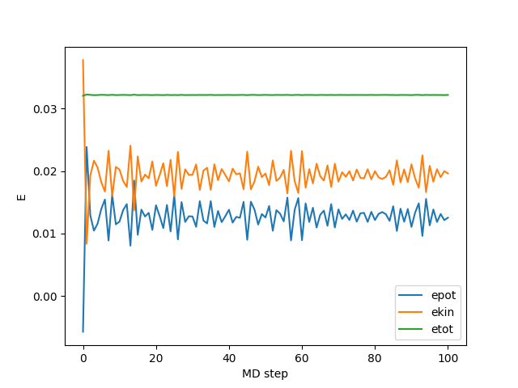

この記事は[Qiita の記事](https://qiita.com/tamaki_osamu/items/4bacfcc7dc78a5bfd94e)を加筆修正したものです。

---

この記事では、分子動力学について簡単に説明して、簡単にシミュレーションを行ってみます。シミュレーションには、[Atomic Simulation Environment](https://wiki.fysik.dtu.dk/ase/index.html)という Python モジュールを使用することにします。

## 分子動力学とは

分子動力学（Molecular Dynamics: MD）は、原子や分子間の相互作用（ポテンシャル）をもとに運動方程式を解いて行くことで、原子や分子の動的過程を得ます。

私たちの身の回りにあるものは、細かく見ていけば原子や分子の集合体です。分子動力学は、この原子や分子の動きを計算することで集合体としての振る舞いを理解しようとするものです。

## とりあえずやってみる

難しい理論は置いておいて、とりあえずやってみましょう。ここでは、[Atomic Simulation Environment(ASE)](https://wiki.fysik.dtu.dk/ase/index.html)という便利なパッケージを使うことにします。

### パッケージを入れる

Python が必要なので適宜環境を構築してください。Python 環境が整ったら、

```bash
pip install --upgrade --user ase
```

で入ります。もし、numpy, scipy, matplotlib がない場合はこの 3 つもインストールします。

```bash
pip install --upgrade --user numpy scipy matplotlib
```

これだけで準備は完了です。

## 銅（Cu）のシミュレーションをやってみる

銅原子（Cu）のシミュレーションをやってみましょう。
（ここで上げる内容は[チュートリアル](https://wiki.fysik.dtu.dk/ase/tutorials/md/md.html)とほとんど同じです。）

### 初期配置を作る

シミュレーションを行うにはまずはじまり（初期配置）を設定してやる必要があります。ここでは、銅原子を[FCC(面心立方格子)](https://ja.wikipedia.org/wiki/%E9%9D%A2%E5%BF%83%E7%AB%8B%E6%96%B9%E6%A0%BC%E5%AD%90%E6%A7%8B%E9%80%A0)上に配置します。FCC とは結晶構造の一種で、銅の結晶はこの FCC の構造を持つことが知られています。

ASE を利用すれば簡単に FCC 上に銅原子を配置できます。

```python
import matplotlib.pyplot as plt
from ase.visualize.plot import plot_atoms
from ase.lattice.cubic import FaceCenteredCubic

size = 3
atoms = FaceCenteredCubic(directions=[[1, 0, 0], [0, 1, 0], [0, 0, 1]],
                          symbol="Cu",
                          size=(size, size, size),
                          pbc=True)
plot_atoms(atoms, rotation=('0x,0y,0z'))
plt.show()
```

これを実行すると、



が得られます。$3\times3\times3$の FCC が作れてますね！

### 初速度を決める

シミュレーションを行うには、初期配置だけでなく、初速度も決める必要があります。ここでは、温度$300k_B$のマクスウェル＝ボルツマン分布に従い速度を決定します。

```python
from ase import units
from ase.md.velocitydistribution import MaxwellBoltzmannDistribution
MaxwellBoltzmannDistribution(atoms, 300 * units.kB)
```

ASE はこれだけで初速度を設定してくれます。

### ポテンシャルを決める

MD を行うには、銅原子間にどうような力が働くのか、すなわちポテンシャルが分かっている必要があります。このポテンシャルには、実験から求めた経験的なポテンシャルや量子力学を駆使し電子の振る舞いからポテンシャルを記述する非経験的なポテンシャルなど、研究用途に応じて実にさまざまなものが利用されています。

今回は[EMT(effective medium theory)](https://en.wikipedia.org/wiki/Effective_medium_approximations)というポテンシャルを用いることにします。これも ASE で簡単に定義できます。

```python
from ase.calculators.emt import EMT
atoms.set_calculator(EMT())
```

はい、これでおわりです。

### 運動方程式を立てる、計算する

最後に、今まで決めてきた銅原子をどのように計算していくかを決めます、このとき、

- アンサンブル（統計集団）
- 微分方程式（運動方程式）の解法

を決める必要があります。アンサンブルとは、原子や分子の集団のことで集団に課せられる制約（たとえば温度一定とか）によりさまざまなアンサンブルに分けることができます。微分方程式の解法とは、コンピューターでいかに微分を解くかという数値計算の技法のことでこれにもさまざまな技法が存在します。

ここでは、もっとも簡単な[ミクロカノニカルアンサンブル](https://ja.wikipedia.org/wiki/%E3%83%9F%E3%82%AF%E3%83%AD%E3%82%AB%E3%83%8E%E3%83%8B%E3%82%AB%E3%83%AB%E3%82%A2%E3%83%B3%E3%82%B5%E3%83%B3%E3%83%96%E3%83%AB)（粒子数$N$, 体積$V$, エネルギー$E$が一定）に従う運動方程式を、[速度ベルレ法](https://en.wikipedia.org/wiki/Verlet_integration)で解きます。

```python
from ase import units
from ase.md.verlet import VelocityVerlet
dyn = VelocityVerlet(atoms, 5 * units.fs)
```

時間刻みは$5$fs（フェムト秒）に設定しています。ちなみに、$1$fs とは$10^{-15}$s のことです。

### MD を実行する

これまでの準備をもとにして実際に MD を実行してみましょう。

```python
from ase.lattice.cubic import FaceCenteredCubic
from ase.md.velocitydistribution import MaxwellBoltzmannDistribution
from ase.md.verlet import VelocityVerlet
from ase import units
from ase.calculators.emt import EMT

# 初期配置をつくる(FCC)
size = 3
atoms = FaceCenteredCubic(directions=[[1, 0, 0], [0, 1, 0], [0, 0, 1]],
                          symbol="Cu",
                          size=(size, size, size),
                          pbc=True)
# ポテンシャルにEMT(effective medium theory)を使う
atoms.set_calculator(EMT())
# 300kbのマクスウェル＝ボルツマン分布に従う運動量を設定する
MaxwellBoltzmannDistribution(atoms, 300 * units.kB)
# 速度ベルレ法でNVE一定のMD計算をする
dyn = VelocityVerlet(atoms, 5 * units.fs)


def printenergy(a=atoms):  # ポテンシャルエネルギー、運動エネルギーの出力
    epot = a.get_potential_energy() / len(a)
    ekin = a.get_kinetic_energy() / len(a)
    print('Energy per atom: Epot = %.3feV  Ekin = %.3feV (T=%3.0fK)  '
          'Etot = %.3feV' % (epot, ekin, ekin / (1.5 * units.kB), epot + ekin))


# MD計算
dyn.attach(printenergy, interval=10)
dyn.run(1000)
```

上記を実行すると、次のような出力が得られます。

```bash
Energy per atom: Epot = -0.006eV  Ekin = 0.044eV (T=340K)  Etot = 0.038eV
Energy per atom: Epot = -0.006eV  Ekin = 0.044eV (T=340K)  Etot = 0.038eV
Energy per atom: Epot = 0.029eV  Ekin = 0.010eV (T= 76K)  Etot = 0.038eV
.....
```

`Epot`がポテンシャルエネルギー、`Ekin`が運動エネルギー、`Etot`が全エネルギーです。
グラフにしてみると、



が得られます。全エネルギーがよく保存していて、NVE 一定のシミュレーションが正しくできていることが分かります。

## おわりに

今回のシミュレーションは、非常に小さく簡単な系に対して非常に短い時間行いました。

より実践的なシミュレーションを行うにはさまざまな工夫が必要になります。たとえば、今回は NVE 一定のシミュレーションを行いましたが、一般的に実験系に近い NVT 一定（カノニカルアンサンブル）のシミュレーションを行いたい場合の方が多いです。NVT 一定のシミュレーションを行うには、[Nosé–Hoover thermostat](https://ja.wikipedia.org/wiki/%E8%83%BD%E5%8B%A2%EF%BC%9D%E3%83%95%E3%83%BC%E3%83%90%E3%83%BC%E3%83%BB%E3%82%B5%E3%83%BC%E3%83%A2%E3%82%B9%E3%82%BF%E3%83%83%E3%83%88)や[Langevin dynamics](https://ja.wikipedia.org/wiki/%E3%83%A9%E3%83%B3%E3%82%B8%E3%83%A5%E3%83%90%E3%83%B3%E5%8B%95%E5%8A%9B%E5%AD%A6)などの方法を用いる必要があります。
あるいは、ポテンシャルに[第一原理計算](https://ja.wikipedia.org/wiki/%E7%AC%AC%E4%B8%80%E5%8E%9F%E7%90%86%E8%A8%88%E7%AE%97)を利用する第一原理分子動力なども盛んに行われています。

実のところ ASE では大変ありがたいことにこれらも簡単に試すことができます。皆さんも一度遊んでみてはどうでしょうか。
