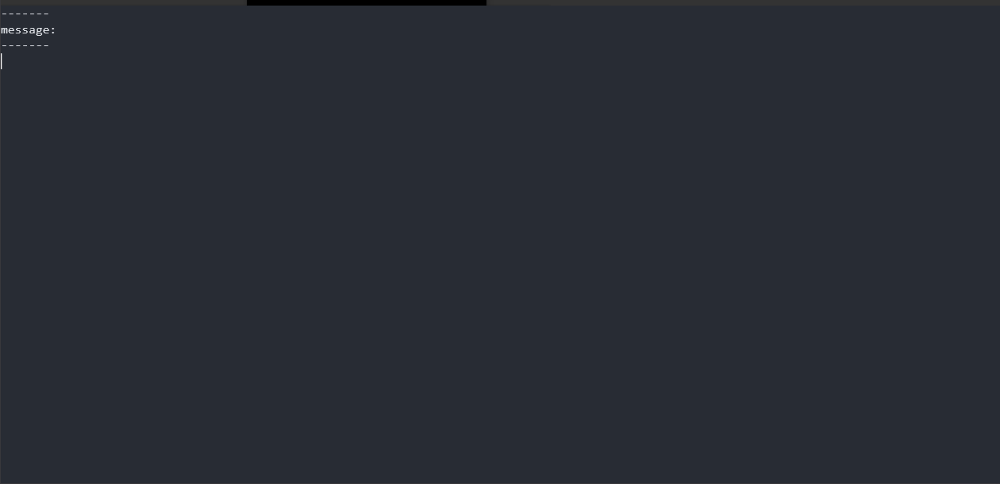
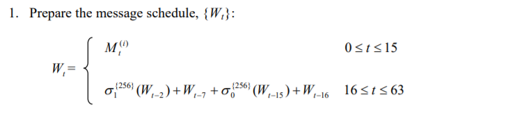
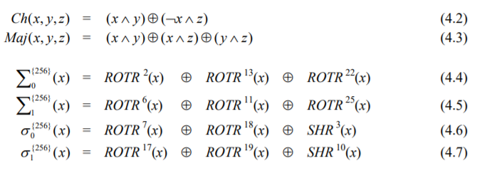
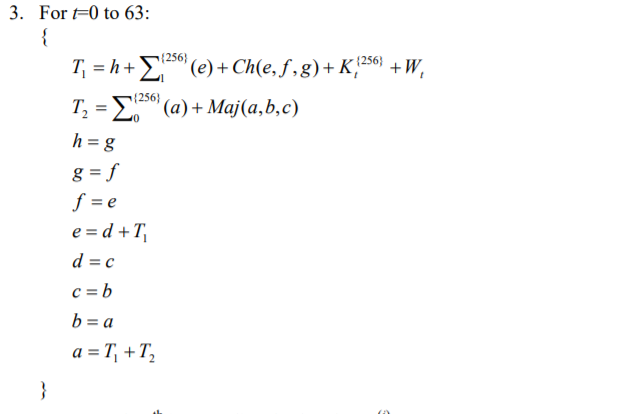

最近、ハッシュ関数（SHA-256 とか）について調べる機会があったのでメモします。

## はじめに

パスワードを保存する時そのまま平文で保存するにはセキュリティ的にあれです。じゃどうするか？暗号化？よく使われるのが（暗号学的）**ハッシュ関数**です。…そう暗号化とハッシュ化は別物!!!別物!!!別物!!!

## 暗号とハッシュ関数

### 暗号とは

> 第三者に漏れないように、当事者間でのみ解読できるよう取り決めた特殊な記号や文字。
>
> (大辞林 第三版 より)

重要なことは、暗号は復号とセットだということです。**データの秘匿**が目的であり元に戻すことが前提となっています。

### ハッシュ関数とは

> 任意のデータから、別の（多くの場合は短い固定長の）値を得るための操作、または、その様な値を得るための関数のこと。
>
> (Wikipedia より)

ハッシュ関数そのものは、簡単に言ってしまえば与えられた入力から別の出力を得る関数のことです。さまざまな場面で利用されており、たとえば[チェックサム](https://ja.wikipedia.org/wiki/%E3%83%81%E3%82%A7%E3%83%83%E3%82%AF%E3%82%B5%E3%83%A0)や[ハッシュテーブル](https://ja.wikipedia.org/wiki/%E3%83%8F%E3%83%83%E3%82%B7%E3%83%A5%E3%83%86%E3%83%BC%E3%83%96%E3%83%AB)なんかが分かりやす例です。

重要なことは、暗号とは異なり**一方向の変換**であるということ。つまり**データの置換**が目的です。

### 暗号学的ハッシュ関数

> ハッシュ関数のうち、暗号など情報セキュリティの用途に適する暗号数理的性質をもつもの。任意の長さの入力を（通常は）固定長の出力に変換する。
>
> (Wikipedia より)

ハッシュ関数の中でもとくに、

1. ハッシュ値（出力）からもとのメッセージ（入力）を求めることが困難であること（原像計算困難性）
2. ある入力 1 が与えられた時、同様の出力となる（**衝突**する）別の入力 2 を求めることが困難であること（第 2 原像計算困難性）
3. 同様の出力となる、異なる入力 1、入力 2 を求めることが困難であること（強衝突耐性）

を満たすものを**暗号学的ハッシュ関数**と呼ぶようです。雑に言ってしまえば、暗号学的ハッシュ関数を使えば「安全なハッシュ」が作れるわけです。パスワードの検証でもこの暗号学的ハッシュ関数が利用されます。そして、この暗号学的ハッシュ関数で有名なのが**SHA-256**です。

#### ところで

パスワードを暗号化ではなくハッシュ化して保存することをはじめて知ったとき、恥ずかしながら「どうやって検証するの？」と疑問に思ってしまいました。だって**ハッシュ化したら元のパスワード分かんなくなっちゃう**し。

でもよくよく考えると、ユーザーが入力したパスワードをハッシュ化し保存してあるハッシュと比較すればよいので、元のパスワードは分からなくて何も問題ないのです。よくできてますね。

## SHA-256 は何をしているのか

SHA-256 は実際どのような計算を行っているのでしょう。SHA-256 の仕様は[FIPS 180-4](https://csrc.nist.gov/csrc/media/publications/fips/180/4/final/documents/fips180-4-draft-aug2014.pdf)で読むことできます。

今回自分で実装してみようかとも思ったのですが、SHA-256 の計算の様子をアニメーションで示してくれる[sha256-animation](https://github.com/in3rsha/sha256-animation)がおもしろかったので使ってみます。

([sha256-animation](https://github.com/in3rsha/sha256-animation) の README が大変勉強になるので SHA-256 を学びたい方は覗いてください。下記は参考まで…)

### 準備

sha256-animation は Ruby で実装されているので Ruby の実行環境が必要です。

```bash
sudo apt install ruby
```

その後リポジトリを clone してきます。

```bash
git clone https://github.com/in3rsha/sha256-animation.git
```

### 実行してみる

次を実行すると文字列`tamaosa`のハッシュ値の計算がはじまります。

```bash
ruby sha256.rb tamaosa
```

実行すると次のような計算がはじまります。



以下、各 step で何をしているのか簡単に触れてみます。

#### message

まず入力された文字列を 2 進数 bit 列に変換します。

#### padding

次に、SHA-256 のブロックサイズは 512bits なので、ビット列の大きさが 512 の倍数になるように**パディング**します。

#### message blocks

次に、512bit ごとの**メッセージブロック**に入力値を切り取ります（入力が 512bit 以下ならメッセージブロックは 1 つ）。

#### message schedule

次に、512bit のメッセージから 32bit×64 の**メッセージスケジュール**を生成します。FIPS 180-4 では次の部分です。



$M$が元の 512bit 列を 32bit 毎に区切ったもので、$W$が生成する 32bit 文字列ですね。
このとき使用される関数は、



で定義されています。$ROTR()$は右ビット回転です。

#### compression

メッセージスケジュールと、あらかじめ定義されている 64 個の定数と 8 個の初期値から、32bit×8 の値を得ます。FIPS 180-4 では次の部分です。



$a,b,...,h$が算出する 32bit×8 の値ですね。このとき、メッセージブロックが複数ある場合は続けて同様の処理を続けます。

#### final hash value

最後に 32bit×8 の値を連結して 256bit のハッシュ値が得られます。完了!!!

## おわりに

アルゴリズムをアニメーションすると分かりやすくて良い!!!

## 参考

- [ハッシュ関数 - Wikipedia](https://ja.wikipedia.org/wiki/%E3%83%8F%E3%83%83%E3%82%B7%E3%83%A5%E9%96%A2%E6%95%B0)
- [暗号学的ハッシュ関数 - Wikipedia](https://ja.wikipedia.org/wiki/%E6%9A%97%E5%8F%B7%E5%AD%A6%E7%9A%84%E3%83%8F%E3%83%83%E3%82%B7%E3%83%A5%E9%96%A2%E6%95%B0)
- [FIPS 180-4](https://csrc.nist.gov/csrc/media/publications/fips/180/4/final/documents/fips180-4-draft-aug2014.pdf)
- [SHA の仕様と実装比較(SHA-256 編)](https://blog.bitmeister.jp/?p=4164)
- [sha256-animation](https://github.com/in3rsha/sha256-animation)
- [アニメーションで感覚的にハッシュ関数「SHA-256」の算出過程を理解できる「SHA-256 Animation」](https://gigazine.net/news/20200514-sha-256-animation/)
