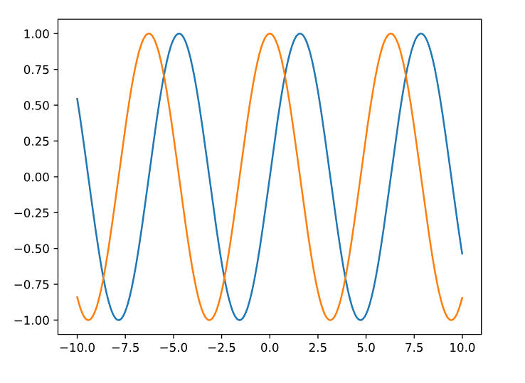
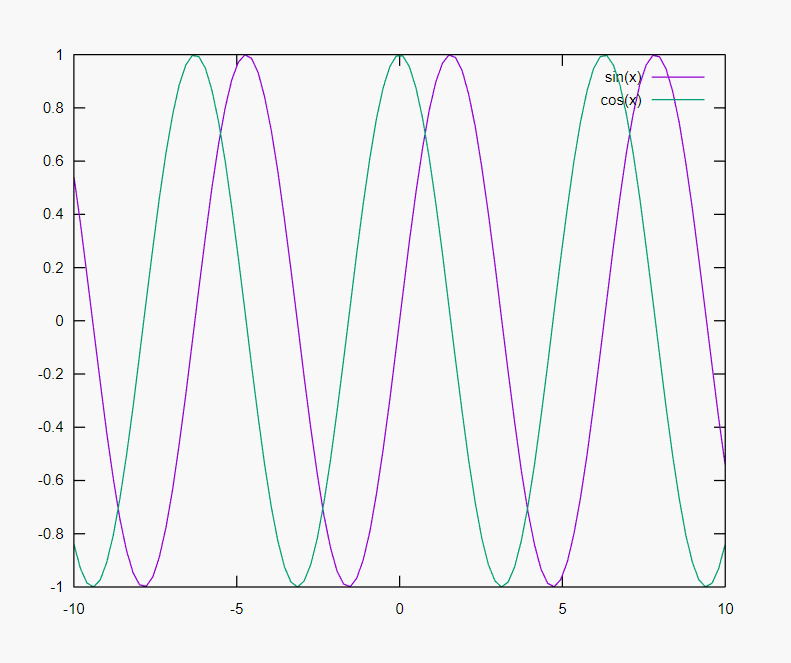

この記事は[Qiita の記事](https://qiita.com/tamaki_osamu/items/b5785930a77d44bba59c)を加筆修正したものです。

---

## はじめに

最近 Visual Studio Code で Markdown 環境を作ったのですが、`markdown-preview-enhanced`が思いのほか何でもできて、とくに理系のノートとして良さげに感じたのでメモします。
すでに良記事（[こちら](https://qiita.com/tomo_makes/items/da4e8fe7d8cf168b545f)や[こちら](https://qiita.com/kitfactory/items/2fde799fa092f0d8f0f1)とか）がたくさん挙げられているので参考にしてください。

## ノートに求めるもの

ノートに求める要素を自分の経験を元に独断と偏見で挙げると、

- 数式が手軽に書ける
- 図が手軽に書ける
- 表が手軽に書ける
- グラフが手軽に書ける

てな感じかと思います。とにかく手軽にサクッと書きたいですよね。
Visual Studio Code + markdown-preview-enhanced はこれらすべてを叶えてくれます。

## markdown-preview-enhanced

markdown-preview-enhanced は、マークダウンのプレビューをしてくれる VSCode のプラグインです。

基本的な使い方としては、Markdown の編集画面で右クリックし"Open Preview to the Side"を選択すればプレビューを見ることができます。

## 数式を手軽に書く

理系のノートには数式が必須です。数式を書く場合は`LaTex`をよく用いると思います（Word の人もいるとは思いますが）。でもノート程度の文書を、いちいち`LaTex`で書くのって面倒なんですよね。コンパイル時間かかるし。

`markdown-preview-enhanced`は、[KaTeX](https://katex.org/)や[MathJax](https://www.mathjax.org/)に対応しています。これらは Web 用の数式組版ライブラリで、高速でありながら Tex 並の数式を書いてくれます。数式は、`$...$`や`$$...$$`で書けます。

$$
X_{n+1} = aX_n(1-X_n)
$$

## 図を手軽に書く

プログラムを書いたときや実験手順を示すのに、フローチャートを書きたくなるときがあるかもしれません。

`markdown-preview-enhanced`は、[PlantUML](http://plantuml.com/ja/index)や[Mermaid](https://mermaidjs.github.io/#/)に対応しています。これらはテキストベースでさまざまな図を描くことができるツールで、もちろんフローチャートも書けます。

### PlantUML

コードブロックに`puml`または`plantuml`を指定します。

````markup
 ```puml
 :遊ぶ;
 :レポート作成;
 ```
````


描画するには`Java`が必要です。また、すべての図を描画するには[Graphviz](https://www.graphviz.org/)が必要です（必須ではないです）。

### Mermaid

コードブロックに`mermaid`を指定します。

````markup
 ```mermaid
 graph LR
 寝る --> レポート作成
 ```
````


## 表を手軽に書く（のせる）

実験結果なんかを表でのせたいことよくあります。ただ、Markdown は表の作成が少々ながら面倒です。だったら、表の作成は他のファイルにお願いしちゃいましょう。

`markdown-preview-enhanced`は、CSV ファイルがインポート可能です。なので、たとえば実験結果をあらかじめ CSV ファイルで出力しておけば、インポートするだけで表が完成します。エクセル等で表を作成しておけば桶です。

```{}
@import "result.csv"
```

ちなみに、この`@import`はさまざまなファイル形式に対応しています。

> - .jpeg（.jpg）、.gif、.png、.apng、.svg、.bmp ファイルは、マークダウンイメージとして扱われます。
> - .csv ファイルはマークダウンテーブルに変換されます。
> - .mermaid ファイルは mermaid によってレンダリングされます。
> - .dot ファイルは、viz.js（graphviz）によってレンダリングされます。
> - .plantuml（.puml）ファイルは PlantUML によってレンダリングされます。
> - .html ファイルは直接埋め込まれます。
> - .js ファイルは`<script src = "your_js"> </ script>`として埋め込まれます。
> - .less および.css ファイルはスタイルとして埋め込まれます。 現在、ローカルの.less ファイルのみがサポートされています。 .css ファイルは`<link rel = "stylesheet" href = "your_css">`として埋め込まれます。
> - .pdf ファイルは、pdf2svg によって svg ファイルに変換されてから組み込まれます。
> - .md ファイルは解析され、直接埋め込まれます。
> - 他のすべてのファイルはコードブロックとしてレンダリングされます。
>
> <https://shd101wyy.github.io/markdown-preview-enhanced/#/file-imports>より引用

## グラフを手軽に書く

理系でグラフを描かない人なんかいないと思います。多くの人はグラフの描画に、`Matplotlib`や`Gnuplot`を用いること多いんじゃないんでしょうか。ところで、グラフを画像にして貼りつけるのって意外に面倒くさくないですか？

`markdown-preview-enhanced`は、**Code Chunk** という機能を持っています。これは Markdown に記述したコードの実行結果を描画する機能です。Code Chunk は` ```lang {cmd=your_cmd opt1=value1 opt2=value2 ...} `のように指定します。

たとえば、markdown に

````markup
    ```bash {cmd=true}
    echo Hello World
    ```
````

と記述すれば、コードブロック

```bash
echo Hello World
```

が描画されると共に、コマンドパレット（Ctrl+Shift+P or F1）で`Markdown Preview Enhanced: Run Code Chunk`または`Markdown Preview Enhanced: Run All Code Chunk`を実行すれば

```{}
Hello World
```

が描画されます。また`@import`を用いて、

```{}
@import "Hellow_World.sh" {cmd=true}
```

としても、同様なことができます。すごいです。

ただしデフォルトでは、この機能はオフになっています。**セキュリティリスク**があるためです。

> この機能はセキュリティを危険にさらす可能性があるため、注意して使用してください！ スクリプトの実行が有効になっているときに悪意のあるコードを含んだマークダウンを開くと、マシンがハッキングされる可能性があります。
>
> <https://shd101wyy.github.io/markdown-preview-enhanced/#/code-chunk>より引用

Code Chunk を有効にするには、`settings.json`に

```js
"markdown-preview-enhanced.enableScriptExecution": true
```

を追加してください。この設定はユーザー設定ではなくワークスペース毎に設定しておく方が無難だと思います。

この Code Chunk を用いれば、Markdown にコードを記述することでグラフを直接埋め込むことができます。

### Matplotlib

Matplotlib で描画する場合は`matplotlib=true`を指定します。

本文に、

````markup
  ```python {cmd=true matplotlib=true}
  import matplotlib.pyplot as plt
  import numpy as np
  x = np.arange(-10, 10, 0.01)
  y_sin = np.sin(x)
  y_cos = np.cos(x)
  plt.plot(x, y_sin)
  plt.plot(x, y_cos)
  plt.show()
  ```
````

と記述すれば、

```python
import matplotlib.pyplot as plt
import numpy as np
x = np.arange(-10, 10, 0.01)
y_sin = np.sin(x)
y_cos = np.cos(x)
plt.plot(x, y_sin)
plt.plot(x, y_cos)
plt.show()
```



が描画されます。

### Gnuplot

Gnuplot を使用する場合は`set terminal svg`を指定します。

本文に、

````markup
    ```gnuplot {cmd=true}
    set terminal svg
    plot [-10:10] sin(x),cos(x)
    ```
````

と記述すれば、

```markup
set terminal svg
plot [-10:10] sin(x),cos(x)
```



が描画されます。

## スライドも作れる

実はスライドも作ることができます。パワポすらいらなくなるとは!!

`markdown-preview-enhanced`は、[Reveal.js](https://revealjs.com/#/)に対応しています。これは HTML と Markdown でスライドが作れるフレームワークで、手軽に本格的なスライドを作成できます。

コマンドパレット（Ctrl+Shift+P or F1）で`Markdown Preview Enhanced: Insert New Slide`を実行すること本文中に、

```markup
<!-- slide -->
```

が入ります。これがスライドの区切りとなります。スライドの内容は Markdown で記述していくいき、スライドが完成したらまた`<!-- slide -->`を入れればおっけーです。

出力は preview 画面で右クリックし html 等を選択すればよいでしょう。

## 参考

- [markdown-preview-enhanced](https://shd101wyy.github.io/markdown-preview-enhanced/#/)
- [【ドキュメントが書きたくなる】Markdown ライブプレビュー + インライン数式/UML/図表 + 綺麗に PDF/Word エクスポートまで](https://qiita.com/tomo_makes/items/da4e8fe7d8cf168b545f)
- [Visual Studio Code + Markdown Preview Enhanced はチームでデファクト化したい Markdown 環境だ！と思う(2017/10 月時点)](https://qiita.com/kitfactory/items/2fde799fa092f0d8f0f1)
