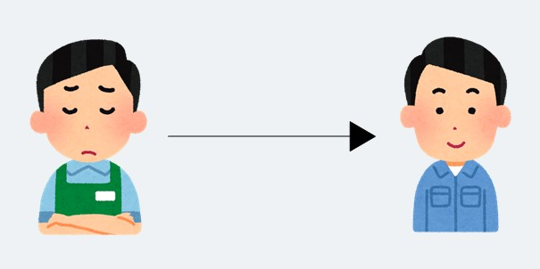
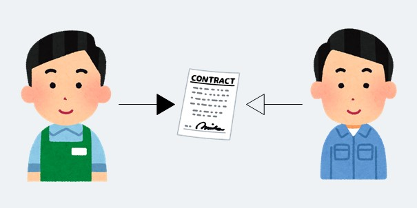
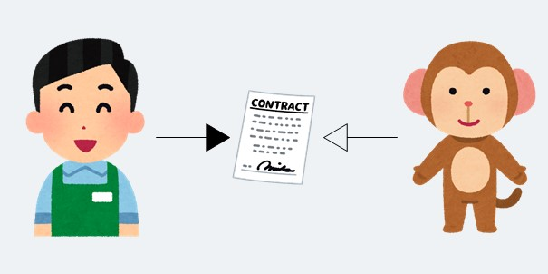
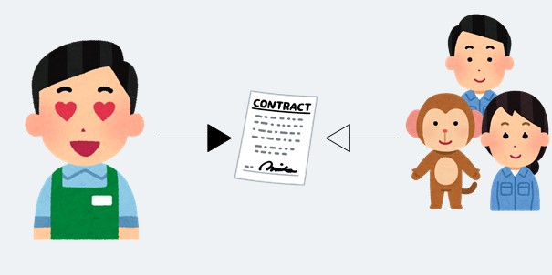
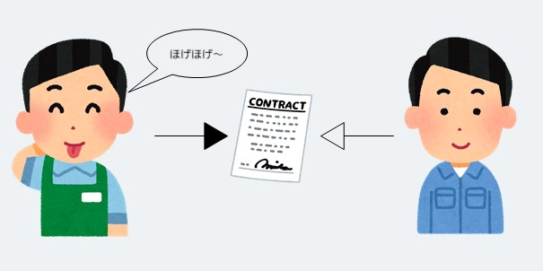

最近なぜか C# を教えるという機会がまれにあるのですが、その中でもインターフェイスは「良く分かん！」となってしまうことが多くて（めっちゃわかる）、どうしたらうまく説明できるのか考えることが多いです。せっかくなので**何番煎じもいいところ**ですがここでもメモしておこうと思います。

## 想定している方

- インターフェイスがどういうものか知ってはいるけれど使うイメージが沸かないという方向けです。
- 一応 C#の`interface`を想定しています（が他の言語も変わらないと思います）。

## 契約と実装の分離？

C#におけるインターフェイスはたとえば[この辺](https://docs.microsoft.com/ja-jp/dotnet/csharp/fundamentals/types/interfaces)を見てもらえればどのようなものか分かると思います。

簡単に言えばインターフェイスを使うと、インターフェイスで何を実装するか（契約[^契約について]）を決めて、インターフェイスを実装すると決めたクラスで実際にメソッドを実装させることができます。これは**契約と実装の分離**とも呼ばれインターフェイスの利点とよく言われます。

う～ん何が嬉しいの…？

## インターフェイスがない世界

突然ですがあなたはとあるお店の店長です。最近お店がとても忙しくなってきたため、**とりあえず運よく捕まえた A さん**を雇う[^雇うとは]ことにしました。A さんには忙しくて自分では覚えられない仕事を代わりに覚えて貰い完全に任せることにしました。

このとき、お店は **A さんという実体に依存した**状態になったと言えます（A さんなしじゃ仕事が回らない！）。こんなとき、もしも A さんがお店に出られなくなったらめちゃくちゃ困ります。急遽別の人を呼んだとしてもおそらく仕事が分からず困ってしまいます。さらにあなたも仕事のやり方が微妙に変わりきっと戸惑うはずです。

## インターフェイスのある世界

そこで、次にあなたは自分が任せたい仕事をあらかじめきっちり整理してこれこれをしてもらうという**契約（インターフェイス）**を作成しました。そしてこの**契約を履行してくれる人**を雇うことにしました。

こうするとたとえば次のような嬉しいことが起こります。

### 依存を解消できる

契約を履行してくれる人を雇い契約した仕事だけをしてもらう[^契約した仕事]ようにすれば、お店はもはや A さんといった実体には依存しなくなります。代わりに**契約（インターフェイス）という抽象にのみ依存**するようになります。なので、たとえば A さんがお店に出られない日があったとしても代わりに契約を履行してくれる誰かがいれば（それが例えサルだとしても！）、いつもと変わらず仕事を進めることができまます。

このことは[依存関係逆転の原則](https://ja.wikipedia.org/wiki/%e4%be%9d%e5%ad%98%e6%80%a7%e9%80%86%e8%bb%a2%e3%81%ae%e5%8e%9f%e5%89%87)と呼ばれたりして、クラス間を疎結合に保ち変更に強いソフトウェアを作るための原則としてよく知られています。ソフトウェアはよく変更されるのでいかに変更しやすく作るかはとても重要です。

### 契約の実現方法を選択できる

契約した仕事だけをしてもらうとき、あなたとしては契約を履行してくれさえすればいいので、その契約の実現方法は履行してくれるそれぞれに任されています。つまり、A さんとサルとでは**契約の実現方法は異なってもよい**訳です。

これは逆にあなたが契約の実現方法を選択できるとも言えます。仕事の適切なやり方は時と場所で異なる[^異なるとは]可能性があります。契約（インターフェイス）があると、契約が履行されることは保証されながらもその実現方法を選択することができます。

これはいわゆる[ポリモーフィズム](https://ja.wikipedia.org/wiki/%E3%83%9D%E3%83%AA%E3%83%A2%E3%83%BC%E3%83%95%E3%82%A3%E3%82%BA%E3%83%A0)というやつの嬉しいところで、たとえば単体テストを行うためのテクニックとして本番用クラスとテスト用クラスが使い分けられたりします。

### お決まりのフレーズが使える

仕事をしているといつも同じような作業の組み合わせが出てきたりします。このような典型的なパターンにはお決まりの共通のフレーズを定めておくと便利なことがあります。契約（インターフェイス）があると**できる仕事が保証されている**ので、この範囲で再利用可能なお決まりのフレーズを定めることができます。

たとえば .NET では[IEnumerable](https://docs.microsoft.com/ja-jp/dotnet/api/system.collections.generic.ienumerable-1?view=net-5.0)というインターフェイスが実装されていれば、`foreach`という誰もが使ったことがある便利な構文を利用することができます。

## おわりに

ということでかなり無理やり[^人に]な気がしますが人になぞらえてインターフェイスを説明してみました（コードが一切出てきてない！）。実際の人の仕事とプログラムの挙動は異なるものなので必ずしも適当な表現ではないと思いますが、インターフェイスという概念の感触を掴むきっかけにしてもらえたら幸いです。

## 参考

- [C# のインターフェース - 未確認飛行 C](https://ufcpp.net/study/csharp/oo_interface.html)

[^契約について]: とはいえ C# 8.0 以降では既定の実装を定義できるようになっていたりします。
[^雇うとは]: ここでの A さんを雇うとは、クラス A に処理を移譲することをイメージしています。
[^契約した仕事]: ここでの契約した仕事だけをしてもらうとは、クラスをインターフェイスへアップキャストすることをイメージしています。
[^異なるとは]: 要件によっては望ましい技術ないしはデータ構造等が異なる可能性があることをイメージしています。
[^人に]: 無理やりですが当事者感？が出てイメージしてもらいやすいかなと思った次第です（コンセントみたいな例の方が適当だとは思ってる）。
